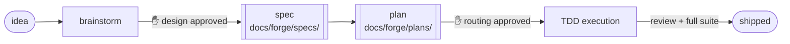
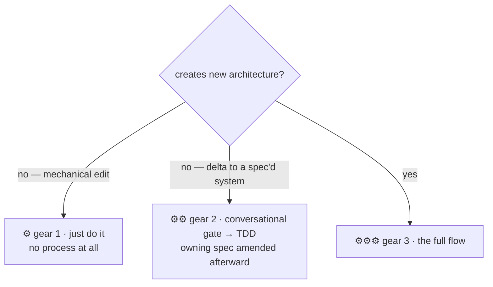

<div align="center">

# ⚒ forge

**Where code gets worked.**

A development process for working with coding agents,
packaged as a plugin for Claude Code and Codex CLI.

[](https://github.com/forcetrainer/forge/blob/main/.claude-plugin/plugin.json)
[](https://code.claude.com/docs/en/plugins)
[](https://developers.openai.com/codex)
[](https://www.python.org/)
[](LICENSE)

[Why it exists](#why-it-exists) ·
[The flow](#the-flow) ·
[Claude Code vs. Codex CLI](#claude-code-vs-codex-cli) ·
[What it costs](#what-it-costs) ·
[Anatomy](#anatomy) ·
[Install](#install) ·
[Lineage](#lineage)

</div>

---

This is how I work with coding agents. It borrows from other tools and
methods, keeps what worked for me, and drops what didn't. I'm not claiming
it's the best way to do this. It's the way that fits how I build things.
Take whatever is useful.

## Why it exists

Coding agents write good code and make bad judgment calls. Working with
them, I kept hitting the same problems:

- **They make design decisions on their own.** Mid-task, the agent picks a
  dependency or a data model — a call I wanted to make — and it's buried in
  a diff I'm skimming.
- **They waste tokens.** Every session re-explores the codebase, workers
  report back with full transcripts, and plans stuffed with code get
  rewritten at execution time anyway.
- **They forget.** Decisions from one session get relitigated the next.
  Deferred work just disappears.
- **They can't scale the process down.** I once watched an agent spend 1.5
  hours setting up a test harness for a one-line edit to an HTML file.

forge puts a gate at each of those failure points and stays out of the way
otherwise.

## The flow

**Brainstorm → spec → plan → TDD execution**, with approval gates between
stages:



Not everything gets the full flow. The routing question is whether a change
creates new structure or works within existing structure — size doesn't
matter:



One more boundary worth stating: the flow starts when I'm ready to build,
not when I'm thinking. Ideas get kicked around in free-form conversation
first — research, comparisons, half-formed notes — with no gates and no
process. The keepers land in `docs/forge/ideas/`, and when one is ready to
become a build, that doc feeds the brainstorm as its starting input. The
flow is for building, not ideating, and I don't force everything through it.

**Brainstorming** turns an idea into a spec through conversation. The agent
asks questions in small batches, proposes a few approaches with a
recommendation, and walks through the design section by section for
approval. The point is to make design decisions in conversation, where
changing course is cheap. Specs stay short and get amended in place as the
system changes.

**Planning** turns the spec into tasks: which files, what interfaces, what
tests, what counts as done. Plans never contain implementation code — code
written before there's compiler and test feedback gets written twice. Each
task is tagged trivial, standard, or complex based on what it actually
requires.

**Execution** sends each task to a worker agent matched to its tier —
cheapest model for trivial work, strongest for complex — pinned per agent so
a session-level model switch can't quietly downgrade a build. Workers do
strict TDD (failing test first, then code). Review scales with risk: trivial
tasks just pass their acceptance commands; bigger tasks get a real review
that **classifies** each finding — **fix** it, **defer** it (logged), or
**halt** for a human decision — and reworks until findings *converge* rather
than for a fixed number of rounds. A final review runs the same loop over the
whole diff. [**The execution loop**](docs/forge/execution-loop.md) is the
full explanation of this cycle, including why it's the same decision logic on
both harnesses.

**Why forge runs implementation serially.** Tasks dispatch one at a time on
both harnesses, even though fanning out independent tasks is technically
possible. Parallelism would only buy wall-clock time — forge's commit
discipline depends on a **linear** history, since each task's review base is
`git diff <prior commit>`, meaningful only across a clean chain of vertical
slices. Parallel writers break that chain and reintroduce the integration
mess per-task commits exist to prevent. Fan-out stays for **read-only** work
(research, independent review lenses); coding writes, and that stays serial.

**Project memory** is three markdown files. `docs/forge/DECISIONS.md` holds
what was decided and why — it's read before new work, and logged decisions
are constraints. `DEFERRALS.md` holds work that was skipped on purpose.
`ROADMAP.md` tracks phases. Workers can skip nice-to-haves if they log it;
they can't skip anything the spec requires.

## Claude Code vs. Codex CLI

The flow, gates, and tiers are identical on both harnesses — only the
execution substrate differs. Claude Code has native session infrastructure to
lean on; Codex CLI doesn't, so forge supplies it.

| | Claude Code | Codex CLI |
|---|---|---|
| Task dispatch | In-session, via the Workflow tool | External deterministic runner, `scripts/forge-run.py` — one `codex exec` process per task |
| Isolation between tasks | Native worktrees | Process boundary (no worktree; sequential on the working tree) |
| Halt visibility | Native session awareness | Foreground-only invocation — a halt relays into the conversation on non-zero exit |
| Commits | Native review/commit flow | Explicit per-task commits (`forge: task N — <title>`) written by the runner |
| Progress view | In-session | Optional live `rich` TUI (`sh .forge/watch`) reading run receipts |

Full Codex operational detail — invocation, `--status`, the monitor, resume
after a halt, and known Codex caveats — is in
[**Running on Codex**](docs/forge/running-on-codex.md).

## What it costs

- **Approval gates mean waiting on me.** For throwaway code or prototyping
  that's pure overhead — skip the flow.
- **Repos fill up with docs.** The flow's memory is files in `docs/forge/`.
  If you don't want documentation as a working habit, this will feel like
  clutter.
- **It's built around how I work:** solo, long-lived projects, making the
  architecture calls myself. A team would draw the lines differently.

## Anatomy

| Piece | What it is |
|---|---|
| `skills/brainstorming` | Gear routing, then idea → design → spec through dialogue. Includes a browser-based visual companion for mockups. |
| `skills/planning` | Spec → plan (what/where, no code) → tiered execution. Codex execution notes in `codex-execution.md`. |
| `skills/tdd` | Red-green-refactor cut to its operational core. Test-harness creation is plan-level work, never a drive-by. |
| `skills/project-memory` | Formats and rules for ROADMAP / DECISIONS / DEFERRALS. |
| `agents/` | The three tier workers (forge-light, forge-standard, forge-deep), model pinned per harness. |
| `scripts/` — briefs & packets | `extract-brief.py` (plan+spec → worker brief) and `review-packet.py` (task block + diff → review packet). Stdlib; used by both harnesses. |
| `scripts/` — Codex runtime | `forge-run.py` (the deterministic plan runner — one `codex exec`/task, receipts, per-task commits), `forge-monitor.py` (the live `rich` TUI), and the `forge_*` / `forge_status` helper modules. Stdlib except the monitor, which needs `rich`. |
| `hooks/session-start` | Injects ~60 words of flow context, only in repos with `docs/forge/` (or legacy `docs/theforge/`, with a rename nudge). Silent everywhere else. |

## Install

### Claude Code

```bash
claude plugin marketplace add forcetrainer/forge
claude plugin install forge@forge
```

To update later: `claude plugin update forge@forge` (or `git pull` in a
local clone).

### Codex CLI

```bash
codex plugin marketplace add /path/to/forge
codex plugin install forge@forge
```

The `SessionStart` hook works on Codex without extra wiring — the shared
`hooks/hooks.json` schema is compatible and Codex sets `CLAUDE_PLUGIN_ROOT`.
Plan execution then runs through forge's own runner, not in-session dispatch
— see [Claude Code vs. Codex CLI](#claude-code-vs-codex-cli) and
[Running on Codex](docs/forge/running-on-codex.md).

Contributing to forge itself (editing skills/agents/hooks) is covered in
[CONTRIBUTING.md](CONTRIBUTING.md).

## Lineage

forge started as a fork of [superpowers](https://github.com/obra/superpowers)
v5.1.0, and the skeleton is still visible: discipline packaged as skills,
brainstorm → plan → execute, TDD throughout. It has diverged a long way
since. Plans no longer embed implementation code, review is proportional
instead of three reviewers per task, the 800-word every-session hook is
gone, and the gears, tier routing, project memory, brief/packet scripts,
and Codex packaging don't exist upstream. The full accounting of what was
kept and cut is in `docs/notes/superpowers-assessment.md`.

Before superpowers, [BMAD](https://github.com/bmadcode/BMAD-METHOD) taught
me what deliberate agentic coding looks like. The mechanics here are
different, but the habits stuck: documentation as working memory, markdown
files as the record of in-flight work, and TDD as the baseline.

The rest is pragmatism about the harness itself: when Claude Code grew a
native feature (worktrees, code review, verification, subagents), the
matching skill got deleted instead of maintained in parallel.

---

<div align="center">
<sub>Built for me, shared in case it's useful to you. <a href="LICENSE">MIT</a>.</sub>
</div>
