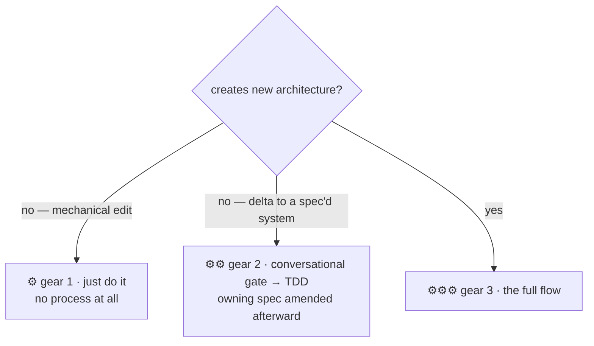

<div align="center">

# ⚒ forge

**Where code gets worked.**

A development process for working with coding agents,
packaged as a plugin for Claude Code and Codex CLI.

[](https://github.com/forcetrainer/forge/blob/main/.claude-plugin/plugin.json)
[](https://code.claude.com/docs/en/plugins)
[](https://developers.openai.com/codex)
[](https://www.python.org/)
[](LICENSE)

[Why it exists](#why-it-exists) ·
[The flow](#the-flow) ·
[What it costs](#what-it-costs) ·
[Anatomy](#anatomy) ·
[Install](#install) ·
[Developing](#developing-editing-skills) ·
[Lineage](#lineage)

</div>

---

This is how I work with coding agents. It borrows from other tools and
methods, keeps what worked for me, and drops what didn't. I'm not claiming
it's the best way to do this. It's the way that fits how I build things.
Take whatever is useful.

## Why it exists

Coding agents write good code and make bad judgment calls. Working with
them, I kept hitting the same problems:

- **They make design decisions on their own.** Mid-task, the agent picks a
  dependency or a data model — a call I wanted to make — and it's buried in
  a diff I'm skimming.
- **They waste tokens.** Every session re-explores the codebase, workers
  report back with full transcripts, and plans stuffed with code get
  rewritten at execution time anyway.
- **They forget.** Decisions from one session get relitigated the next.
  Deferred work just disappears.
- **They can't scale the process down.** I once watched an agent spend 1.5
  hours setting up a test harness for a one-line edit to an HTML file.

forge puts a gate at each of those failure points and stays out of the way
otherwise.

## The flow

**Brainstorm → spec → plan → TDD execution**, with approval gates between
stages:


Not everything gets the full flow. The routing question is whether a change
creates new structure or works within existing structure — size doesn't
matter:



One more boundary worth stating: the flow starts when I'm ready to build,
not when I'm thinking. Ideas get kicked around in free-form conversation
first — research, comparisons, half-formed notes — with no gates and no
process. The keepers land in `docs/forge/ideas/`, and when one is ready to
become a build, that doc feeds the brainstorm as its starting input. The
flow is for building, not ideating, and I don't force everything through it.

**Brainstorming** turns an idea into a spec through conversation. The agent
asks questions in small batches, proposes a few approaches with a
recommendation, and walks through the design section by section for
approval. The point is to make design decisions in conversation, where
changing course is cheap. Specs stay short and get amended in place as the
system changes.

**Planning** turns the spec into tasks: which files, what interfaces, what
tests, what counts as done. Plans never contain implementation code — code
written before there's compiler and test feedback gets written twice. Each
task is tagged trivial, standard, or complex based on what it actually
requires.

**Execution** sends each task to a worker agent matched to its tier:
`forge-light` (cheap model), `forge-standard`, or `forge-deep` (strongest
model). The model is pinned in the agent definition, so switching models at
the session level can't quietly downgrade a build. Workers do strict TDD
(failing test first, then code) and get their instructions from generated
brief files, so plan and spec content doesn't pile up in the orchestrator.
Review scales with risk: trivial tasks just have to pass their acceptance
commands, bigger tasks get a real review, a second reviewer only steps in if
the first finds problems, and after two fix rounds it comes back to me. A
final review covers the whole diff.

**Project memory** is three markdown files. `docs/forge/DECISIONS.md` holds
what was decided and why — it's read before new work, and logged decisions
are constraints. `DEFERRALS.md` holds work that was skipped on purpose.
`ROADMAP.md` tracks phases. Workers can skip nice-to-haves if they log it;
they can't skip anything the spec requires.

## What it costs

- **Approval gates mean waiting on me.** For throwaway code or prototyping
  that's pure overhead — skip the flow.
- **Repos fill up with docs.** The flow's memory is files in `docs/forge/`.
  If you don't want documentation as a working habit, this will feel like
  clutter.
- **It's built around how I work:** solo, long-lived projects, making the
  architecture calls myself. A team would draw the lines differently.

## Anatomy

| Piece | What it is |
|---|---|
| `skills/brainstorming` | Gear routing, then idea → design → spec through dialogue. Includes a browser-based visual companion for mockups. |
| `skills/planning` | Spec → plan (what/where, no code) → tiered execution. Codex execution notes in `codex-execution.md`. |
| `skills/tdd` | Red-green-refactor cut to its operational core. Test-harness creation is plan-level work, never a drive-by. |
| `skills/project-memory` | Formats and rules for ROADMAP / DECISIONS / DEFERRALS. |
| `agents/` | The three tier workers (forge-light, forge-standard, forge-deep), model pinned per harness. |
| `scripts/` | `extract-brief.py` (plan+spec → worker brief), `review-packet.py` (task block + diff → review packet). Stdlib Python. |
| `hooks/session-start` | Injects ~60 words of flow context, only in repos with `docs/forge/` (or legacy `docs/theforge/`, with a rename nudge). Silent everywhere else. |

## Install

### Claude Code

```bash
claude plugin marketplace add forcetrainer/forge
claude plugin install forge@forge
```

To update later: `claude plugin update forge@forge` (or `git pull` in a
local clone).

### Codex CLI

```bash
codex plugin marketplace add /path/to/forge
codex plugin install forge@forge
```

The `SessionStart` hook works on Codex without extra wiring — the shared
`hooks/hooks.json` schema is compatible and Codex sets `CLAUDE_PLUGIN_ROOT`
for plugin-hook compatibility.

Plan execution runs through a deterministic runner instead of in-session
subagent dispatch — one `codex exec` process per task, pinned model/effort
per tier:

```bash
python3 "$CLAUDE_PLUGIN_ROOT/scripts/forge-run.py" <plan.md> --spec <spec.md>
```

**Precondition:** the runner requires a clean working tree at start — `git status --porcelain` empty, with `.forge/` self-ignored. Dirty trees cause a contract error (exit 1) naming the dirty paths; commit or discard before re-invoking.

**Per-task commits:** after each task passes, the runner stages all changes and commits with message `forge: task N — <title>`. This establishes a clean checkpoint after every passed task for per-task review and resume. `.forge/` is never staged; the ledger annotation rides in the commit. Escalated tasks commit nothing — uncommitted work stays for human resolution.

See `skills/planning/codex-execution.md` for the invocation contract,
halt/resume, and the orchestrator's reduced role. Receipts land in
`.forge/runs/<timestamp>/`, uncommitted — the runner writes a self-ignoring
`.forge/.gitignore` (`*`) on first run, so there's no target-repo setup.

<details>
<summary><strong>Known Codex caveats</strong></summary>

These apply to ad-hoc in-session Codex subagents (exploration, one-off
review) — the only place forge still spawns them. Plan execution goes
through `forge-run.py`'s one-`codex exec`-process-per-task instead, which
sidesteps both issues by construction (no parent-model inheritance, no
completed-worker accumulation).

- Subagent selection has known regressions (custom-agent selection broke in
  v0.137.0 and spawned agents silently inherited the parent model). If
  spawned agents run the wrong model, check acceptance-command output rather
  than trusting the spawn.
- Spawned subagents pile up in the CLI's agent list, and completed workers
  keep counting against the thread limit
  ([openai/codex#19197](https://github.com/openai/codex/issues/19197),
  [openai/codex#22779](https://github.com/openai/codex/issues/22779)).

</details>

## Developing (editing skills)

On the machine where you edit the plugin, point the marketplace at your
working copy so edits are picked up locally:

```bash
claude plugin marketplace add ~/development/forge
```

The plugin cache only re-syncs on a **version bump**. After editing anything
under `skills/`, `agents/`, or `hooks/`:

```bash
# 1. bump "version" in BOTH .claude-plugin/plugin.json and .codex-plugin/plugin.json (lockstep — a test enforces it)
# 2. then:
claude plugin update forge@forge
# 3. restart the session to apply
```

This repo uses its own conventions: decisions live in
`docs/forge/DECISIONS.md` (read it before changing skill behavior), skipped
work in `docs/forge/DEFERRALS.md`. The `docs/forge/` directory also opts
this repo into its own session hook.

## Lineage

forge started as a fork of [superpowers](https://github.com/obra/superpowers)
v5.1.0, and the skeleton is still visible: discipline packaged as skills,
brainstorm → plan → execute, TDD throughout. It has diverged a long way
since. Plans no longer embed implementation code, review is proportional
instead of three reviewers per task, the 800-word every-session hook is
gone, and the gears, tier routing, project memory, brief/packet scripts,
and Codex packaging don't exist upstream. The full accounting of what was
kept and cut is in `docs/notes/superpowers-assessment.md`.

Before superpowers, [BMAD](https://github.com/bmadcode/BMAD-METHOD) taught
me what deliberate agentic coding looks like. The mechanics here are
different, but the habits stuck: documentation as working memory, markdown
files as the record of in-flight work, and TDD as the baseline.

The rest is pragmatism about the harness itself: when Claude Code grew a
native feature (worktrees, code review, verification, subagents), the
matching skill got deleted instead of maintained in parallel.

---

<div align="center">
<sub>Built for me, shared in case it's useful to you. <a href="LICENSE">MIT</a>.</sub>
</div>
