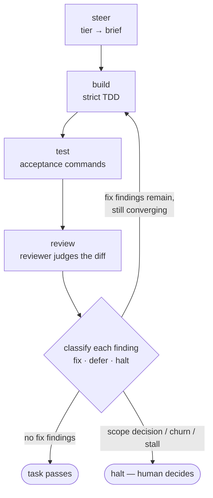

# The execution loop — how forge steers, builds, tests, reviews, and fixes

This is the core of forge: the cycle a task runs through from brief to shipped,
and how the system decides — on its own — what to fix, what to let go, and what
to stop and ask a human about. It's the same model on both harnesses; only the
*substrate* that enforces it differs (see [Per-harness](#per-harness--same-model-different-substrate)).

The precise contract lives in the [scope-autonomy spec](specs/2026-07-16-phase7-scope-autonomy-design.md);
the *why* behind each choice is in [DECISIONS.md](DECISIONS.md). This page is the
readable explanation.

## The cycle

Each task is dispatched to a worker matched to its tier, which does strict TDD.
Then a reviewer judges the result, every finding is **classified**, and the
runner acts on that classification — reworking as long as it's making progress,
and halting the moment it isn't.

The two hard questions this loop answers are **what to fix** (the disposition
matrix) and **when to stop trying** (convergence). They're separate, and getting
both right is what keeps the loop from either shipping subtly-wrong code or
spinning forever.

## The disposition matrix — what to fix

Every review finding is classified on two independent axes:

- **Provenance** — is the finding *in this task's diff*, or *pre-existing*? This
  is verified by the runner against the actual diff line ranges, **not** trusted
  from the reviewer. A finding whose lines fall outside the diff is pre-existing,
  overriding any optimistic reviewer claim.
- **Contract impact** — is it **contract-breaking** (violates a *named*
  acceptance criterion) or an **improvement** (nicer, but nothing promised was
  broken)? Contract-breaking requires the reviewer to cite the criterion; with no
  named citation, the runner downgrades it to an improvement.

Cross the two and every finding lands in exactly one cell with a different action:

|                  | contract-breaking            | improvement-only         |
| ---------------- | ---------------------------- | ------------------------ |
| **in this diff** | ✅ **fix** — rework in-loop  | 📝 **defer** — log it    |
| **pre-existing** | ⚠️ **halt** — human decides  | 📝 **defer** — log it    |

**Only the top-left cell is ever auto-fixed.** Everything else defers or halts.
That bias is deliberate: an autonomous fixer's failure mode is *over*-fixing, and
over-fixing is just diff over-scoping in disguise — the exact thing per-task
commit discipline exists to prevent. So the rule is fix-what-you-broke-against-
the-contract, and nothing else.

This also answers "harmless vs. harmful deferral." A harmless deferral is an
improvement — it goes to `DEFERRALS.md` and the run continues. A *harmful* one —
a real contract-breaking bug that's **pre-existing** (our change surfaced it, or
depends on it) — is the one cell that must never be silently deferred *or*
silently fixed (fixing it expands scope past the task). That's a genuine human
decision, so it **halts**, carrying a drafted repair task for the human to
approve.

Deferred findings are aggregated into the run summary; the orchestrator writes
them to `DEFERRALS.md` at completion. The runner never edits that file mid-loop.

## Convergence — when to stop trying

The matrix decides *whether* a finding is worth fixing. Convergence decides *when
to stop reworking*. A raw attempt counter can't tell the difference between
"closing findings" and "shuffling one bad state into another" — so forge doesn't
use one as the primary control.

On each re-review the reviewer is shown the **prior attempt's findings** (threaded
into the review packet) and labels each current finding:

- **resolved** — was there, now gone
- **carried** — still unresolved from last time
- **new** — appeared this round

The runner then decides deterministically, in this precedence:

1. **Gate mode** + any finding → **halt** (the conservative escape hatch, below).
2. Any **halt-disposition** finding (pre-existing × contract-breaking) → **halt** (scope decision).
3. **Regression** → **halt**: a previously *resolved* finding reappears, or acceptance went green→red. This is the "shuffling bad state to bad state" case — a fix undid an earlier fix, or broke the build.
4. **Stuck** → **halt**: a fix finding is *carried* across two consecutive attempts with nothing resolved — the worker can't crack it.
5. No fix findings remain and acceptance is green → **pass**.
6. Otherwise → **rework**, up to a **backstop of 5** attempts (a seatbelt, not a target).

The key inversion from a counter: **converging work runs to completion.** Net
progress isn't required every round — a round may resolve one finding and surface
another — and the loop keeps going as long as it's genuinely closing findings.
The backstop only catches slow oscillation that never lands. (This replaced the
old hard cap of 2, which halted converging work one iteration early — the escalated
fix usually landed on the very next manual run, which is the tell that the counter
was stopping good work.)

## Final review — the same loop over the whole plan

Once every task passes, one final review runs over the **whole-plan diff** at the
plan's highest tier. It is *not* a single-shot gate — it runs the **same**
disposition matrix and convergence loop: findings are classified, fix-disposition
findings drive a fix dispatch, and it re-reviews until it converges to pass or
halts on the same conditions as a task. Its job is the integration defects a
per-task review can't see — an interface mismatch between tasks, a contract that
doesn't hold end-to-end.

## Autonomy and doc-sync

**`--autofix auto | gate`** — chosen at the execution offer.

- `auto` (default): run the matrix. Fix the top-left cell, defer improvements,
  halt only genuine scope decisions. The everyday mode — the manual stop mostly
  isn't needed once the matrix and convergence guards are doing their job.
- `gate`: the conservative escape hatch — **any** finding halts for a human, no
  auto-fix. This is the pre-convergence behavior, kept for cautious runs.

**Terminal doc-sync** — after an all-green run, one reconcile-only pass updates
existing docs the diff made stale (references, signatures, changelogs) — it never
authors new docs (that would be the gold-plating the matrix forbids). If it finds
a doc/contract contradiction it can't mechanically reconcile, it halts with the
contradiction named. It runs *after* everything else is green, so it can never
mask a code defect as doc drift.

## Per-harness — same model, different substrate

The model above is what forge *wants* on both harnesses. What enforces it differs,
and — as of this writing — the two harnesses are at different points on the way to
it.

**Codex (`scripts/forge-run.py`) — enforced in code.** The runner *is* the loop:
one `codex exec` process per task with model/effort pinned per tier, the
disposition matrix and convergence decided deterministically in Python, receipts
and per-task commits as the durable record, and the terminal doc-sync stage. A
halt is an exit code (2 = escalation, 1 = contract error) the foreground
orchestrator relays into the conversation. Because each worker is
**context-isolated** — born, used, discarded — a cross-cutting final-review
finding has no single worker that "owns" it, which is exactly why halting is the
safe move for those.

**Claude Code — inline, and catching up.** Claude executes a plan natively
(in-session dispatch, native worktrees, code review), holding a **persistent
whole-plan reasoning context**. That context is an asset the Codex runner doesn't
have — it *can* own a cross-cutting finding — but today the Claude path still uses
the simpler cap-and-escalate model; the disposition matrix and convergence
machinery are Codex-only.

**The convergence.** These are two halves of one target (tracked in
[DEFERRALS.md](DEFERRALS.md)):

- **Codex → more autonomous** — the disposition matrix + convergence + doc-sync.
  *(Phase 7, done.)*
- **Claude → more bounded** — stop auto-resolving *decision-grade* findings inline;
  surface them at the gate instead of fixing-first-reporting-after, matching the
  discipline Codex enforces structurally. *(Phase 8, planned.)*

The asymmetry isn't a bug — it's structural. Claude inline can hold the context to
resolve more; the Codex runner is a stateless dispatcher and must halt more. Both
are steering toward the same middle: **classify each finding, fix the mechanical,
halt the decisions.**
